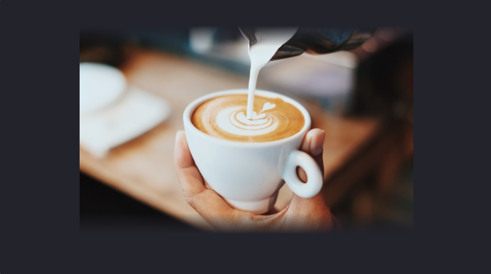
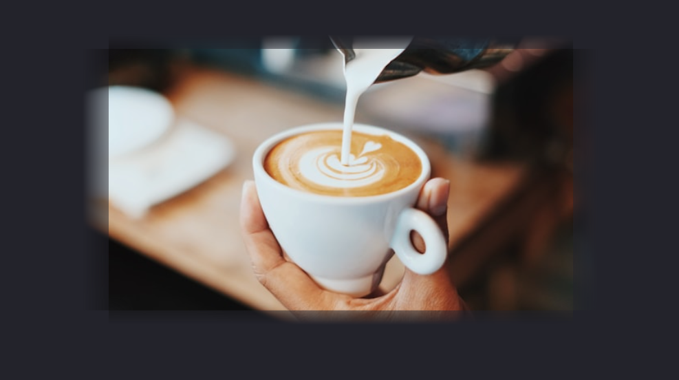
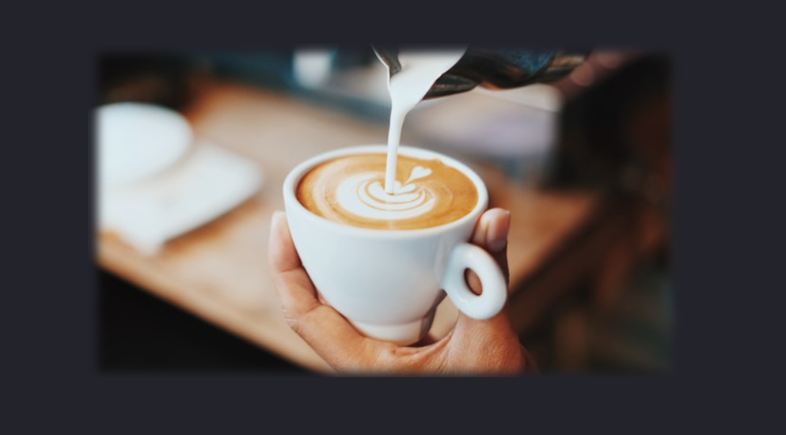
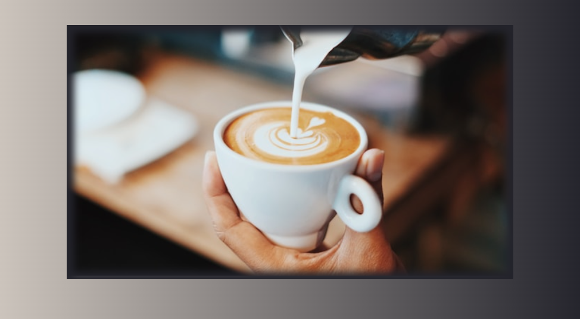

# 如何用 CSS 模糊圖片的邊緣？ Fuzzy Border
副標：

前這子公司遇到這樣設計的需求 👇


我第一個想法試用 `mask` 製作，後來 mask 遇到一些問題，就又想了另外兩個思路來製作，你知道怎麼做嗎？

## 邊緣模糊圖片的 HTML 和 CSS
先簡單看一下 HTML 和 CSS，這裡沒甚麼特別的。
```html
<div class="container mask">
  
</div>
```

```css
.container {
  width: 600px;
  aspect-ratio: 16 / 9;
  position: relative;
  display: block;
}
.container img {
  width: 100%;
  height: 100%;
  object-fit: cover;
}
```
## 模糊邊緣做法 1 - mask 的問題
一開始想用 mask 將邊緣模糊，想法是利用兩個 `linear-gradient`，一個將上下的 border 遮蓋，另一個將左右的 border 遮蓋。但其實這樣會有問題，先讓你看一個 mask 的效果。
```css
.mask img {
  mask-image: 
    linear-gradient(to top, transparent 0%, black 10%, black 90%, transparent 100%), 
  mask-size: 90% 100%;
  mask-repeat: no-repeat;
  mask-position: center bottom;
}
```


可以看出上下已經被 mask 遮蓋了，簡單解釋一下，mask 的用法和 background 一樣，只不過透明的地方會被遮蓋。

1. 所以上面在 0% 的位置是透明的，這意味著在這部分的圖片會被遮蓋。
2. 從 10% 到 90% 的位置是黑色的，這部分的圖面顯示正常。
3. 在 100% 的位置又變回透明，所以圖片的頂部又會有遮罩效果。

接著讓我們利用 css 的多重背景繼續增加左右的模糊邊緣。

```css
.mask img {
  mask-image: 
  linear-gradient(to top, transparent 0%, black 10%, black 90%, transparent 100%), 
  linear-gradient(to right, transparent 0%, black 10%, black 90%, transparent 100%);
  mask-size: 90% 100%, 100% 90%;
  mask-repeat: no-repeat;
  mask-position: center bottom, center;
}
```


可以發現問題了，由於上下的 mask 不會被左右的 mask 影響，左右的 mask 也不會被上下的影響，所以在邊緣會非常奇怪。

最後我捨棄了用 mask 的方法。

## 模糊邊緣做法 2 - box-shadow
這種做法算是非常簡單粗暴，利用 shadow inset，在圖片內側加上和背景一樣的陰影，就可以做到模糊的效果
```html
<div class="container box-shadow">
  
</div>
```
```css
.box-shadow::after {
  content: '';
  position: absolute;
  inset: 0;
  box-shadow: inset 0px 0px 10px 10px #23232b;
}
```

會選擇將 `box-shadow` 加在偽元素上是因為如果加在 `.container` 會被圖片蓋住，而直接加在圖片上也沒有用，所以直接用偽元素並調整 z-index 使其蓋在圖片上，再配合 box-shadow 即可。

效果很好。



但 `bos-shadow` 會遇到一個問題，如果背景不是純色，而是漸變，就會露出馬腳。



## 模糊邊緣做法 3 - svg

所以最後只好請出大魔王 svg 了

```html
<div class="container svg">
  <svg  xmlns="http://www.w3.org/2000/svg">
    <defs>
      <filter id="blur" filterUnits="userSpaceOnUse">
        <feGaussianBlur stdDeviation="10" />
      </filter>
  
      <mask id="fuzzy-border-mask">
        <rect x="10%" y="10%" width="80%" height="80%" fill="black" filter="url(#blur)" />
      </mask>

    </defs>
  </svg>
  
</div>
```
```css
.svg img {
  width: 100%;
  height: 100%;
  object-fit: cover;
  mask-image: url(#fuzzy-border-mask);
  mask-mode: alpha;
}

.svg svg{
  width: 100%;
  height: 100%;
  position: absolute;
  z-index: 1;
} 
```
解釋幾個重要的點，

`<defs>`

在SVG中，defs標籤用來定義可重覆使用的元素。在這裡，我們定義了一個過濾器和一個遮罩。

`<filter id="blur" filterUnits="userSpaceOnUse">`

命名一個 blur 濾鏡。

`<feGaussianBlur stdDeviation="10" />`

feGaussianBlur 可以產生高斯模糊效果，stdDeviation 則是設定模糊程度。

```html
<mask id="fuzzy-border-mask">
  <rect x="10%" y="10%" width="80%" height="80%" fill="black" filter="url(#blur)" />
</mask>
```

接著定義一個遮罩定義，位置為 SVG 的中間（留下10%的邊緣），填充顏色為黑色。並使用了剛剛定義的 blur 濾鏡。

```css
.svg img {

  mask-image: url(#fuzzy-border-mask);
  mask-mode: alpha;
}
```
接著在 css 加入 `mask-image: url(#fuzzy-border-mask);` 就可以將 SVG 中定義的遮罩應用到圖片上，產生模糊邊框的效果。

而 mask-mode: alpha 是指定遮罩的模式，這裡是根據透明度來裁剪圖片。

這樣就完美做出模糊邊緣的圖片了！


## 小結

今天用了三種方式帶你做圖片邊緣模糊的效果，svg 用的好果然很厲害啊～！

那今天就這樣，下篇貼文見！